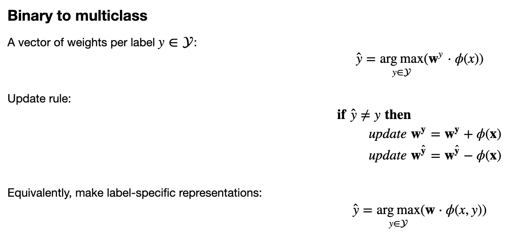

# Lab - Part-of-Speech tagging with the Perceptron Algorithm


## Introduction

In this lab we will create a Part-of-Speech (PoS) tagger for English using the Perceptron algorithm. 
In particular, we will train a PoS tagger on the [Brown corpus](http://clu.uni.no/icame/manuals/BROWN/INDEX.HTM) annotated with the [Universal Part-of-Speech Tagset](https://arxiv.org/abs/1104.2086). 

Although PoS-tagging is an inherently sequential problem, for the purposes of this lab we will keep things simple: our model will predict a PoS-tag for every word of a sentence *independently*.
More concretely, given a sentence (sequence of words) as input, your model needs to predict a PoS-tag for each of them.

Here is an example:

| **PoS**:   | DET | VERB      | NOUN | VERB |     ADV      | ADJ       | . |
|:-------|:-----:|:-----------:|------|:------:|:--------------:|:-----------:|:---:|
| **Words**: | The | scalloped | edge | is   | particularly | appealing | . |
  

## Requirements
You need to download the Brown corpus first through NLTK if you don't have it already. 
Just execute the following in a Python CLI:

```python
import nltk
nltk.download('brown')
``` 

## Exercises


#### 1. Perceptron Algorithm

Implement the standard perceptron algorithm. Use the first 10000/1000/1000 sentences for training/dev/test.
In order to speed up the process for you, we have implemented a simple dataset reader that automatically converts the Brown corpus using the Universal PoS Tagset: `athnlp/reader/brown_pos_corpus.py` (you may use your own implementation if you want; `athnlp/reader/en-brown.map` provides the mapping from Brown to Universal Tagset). 

**Important**: Recall that the perceptron has to predict multiple (PoS tags) instead of binary classes:


You should represent each example of the corpus (i.e., every word of each sentence) in a vector form. In order to keep things simple, let's assume a simple **bag-of-words** representation.
In order to evaluate your model compute the **accuracy** (i.e., number-of-correctly-labelled-words / total-number-of-labelled-words) on the dev set.
Here are a few things to try out:
- Does it help if you **randomize** the order of the training instances?
- Does it help if you perform **multiple passes** over the training set? What is a reasonable number?
- Instead of using the last weight vector for computing the error, try taking the **average of all
the weight vectors** calculated for each label. Does that help?

#### 2. Feature Engineering

- Implement different types beyond bag-of-words. *Hint*: One very common feature type is to 
introduce some local context for every word via **n-grams**, usually with n=2,3. Another is to
look at the previous/next **word** (not **tag**; why?). A third option is to look at subword features,
i.e. short character sequences such as suffixes.
- (Bonus) What are the most **positively-weighted** features for each label? Give the
top 10 for each class and comment on whether they make sense (if they
don’t you might have a bug!).


